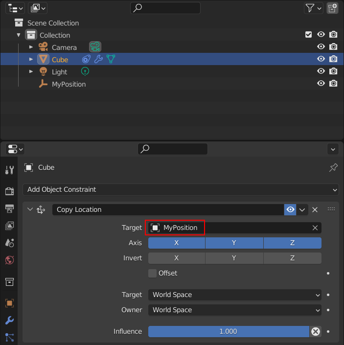

# reg, a registry library

This library gives an identity to your value-types, turning them into objects stored in a `reg::Registry`. You can reference and access your objects through a `reg::Id`.

You can see `reg::Id`s as references which will never get invalidated unless you explicitly ask the registry to destroy the object. Even after an object has been destroyed it is safe to query the registry for the destroyed object through its id: the registry will simply return null (`nullptr` or `std::nullopt`) and you will have to handle the fact that the object no longer exists. Basically this is like a reference which knows whether it is dangling or not and will never let you read garbage memory.

This library allows you to manually control the lifetime of objects and to keep references to those objects. These references will never get invalidated, even upon restarting your application: they are safe to serialize.

## Table of Content

- [Use case](#use-case)
- [Tutorial](#tutorial)
  * [Creating an object](#creating-an-object)
  * [Accessing an object](#accessing-an-object)
  * [Modifying an object](#modifying-an-object)
  * [Destroying an object](#destroying-an-object)
  * [Iterating over all the objects](#iterating-over-all-the-objects)
  * [Managing the lifetime of objects](#managing-the-lifetime-of-objects)
  * [Thread safety](#thread-safety)
  * [More examples](#more-examples)
- [Notes](#notes)
  * [Why can't I just use native pointers (*) or references (&)?](#why-can-t-i-just-use-native-pointers-----or-references-----)
  * [We don't provide automatic lifetime management](#we-don-t-provide-automatic-lifetime-management)
  * [Performance is not our main concern](#performance-is-not-our-main-concern)
- [Future developments](#future-developments)
  * [`for_each` functions](#-for-each--functions)

## Use case

This library was designed for this specific use case:

**_You want to create user-facing objects that will be referenceable across the application, as in Blender's Scene Collection:_**


> The *Cube*'s constraint references the *MyPosition* object. We want this reference to live forever (or at least until the user changes it).

## Tutorial

### Creating an object

A `reg::Registry` stores values of a given type. For example you can create a
```cpp
reg::Registry<float> registry{};
```

You can then create objects in the registry:
```cpp
reg::Id<float> id = registry.create(5.f);
```

This will return you an id that you can later use to get your object back from the registry.

### Accessing an object

The preferred way is to use `get()`.

Since the object could have been destroyed at any time by another part of the application you always have to check that `get()` actually returned you a value:

```cpp
const std::optional<float> maybe_value = registry.get(id);
if (maybe_value) // Check that `maybe_value` contains a value
{
    std::cout << "My value is "
              << std::to_string(*maybe_value) // Use the value `*maybe_value`
              << '\n';
}
```

If you cannot afford to pay the cost of the copy (for example when storing big `std::vector`s in your registry) you can use `get_ref()` instead:

```cpp
{
    std::shared_lock lock{registry.mutex()}; // I only want to read so I can use a shared_lock
    const float* const maybe_value = registry.get_ref(id);
    if (maybe_value) // Check that `maybe_value` contains a value
    {
        std::cout << "My value is "
                  << std::to_string(*maybe_value) // Use the value `*maybe_value`
                  << '\n';
    }
}
```

**NB:** you should never store a reference returned by `get_ref()`: this would defeat the whole point of this library! Always query for the object by using `get_ref()` when you need it.

### Modifying an object

The preferred way is to use `set()`:

```cpp
registry.set(id, 22.f);
```

If the object was not present in the registry `set()` will do nothing and return `false`; otherwise it will return `true`.

If your objects are big and you don't want to perform a full assignment (for example if you are storing `std::vector`s and only want to modify one element in one vector) you can use `get_mutable_ref()` instead:

```cpp
{
    std::unique_lock lock{registry.mutex()}; // I want to modify so I need a unique_lock
    float* const maybe_value = registry.get_mutable_ref(id);
    if (maybe_value) // Check that `maybe_value` contains a value
    {
        *maybe_value = 22.f;
    }
}
```

**NB:** you should never store a reference returned by `get_mutable_ref()`: this would defeat the whole point of this library! Always query for the object by using `get_mutable_ref()` when you need it.

### Destroying an object

```cpp
registry.destroy(id);
```

You can always call `destroy()`, even if the id isn't valid. This will remove the object from the registry (if it was there in the first place).

### Iterating over all the objects

You can iterate over all the objects in the registry, but the order is not guaranteed. This is why you should probably maintain your own `std::vector<reg::Id<T>>` to have the control over the order the objects will be displayed in in your UI for example.

```cpp
{
    std::shared_lock lock{registry.mutex()}; // I only want to read so I can use a shared_lock
    for (const auto&[id, value] : registry) 
    {
        // ...
    }
}
```
```cpp
{
    std::unique_lock lock{registry.mutex()}; // I want to modify so I need a unique_lock
    for (auto&[id, value] : registry) 
    {
        // ...
    }
}
```

### Managing the lifetime of objects

:warning: **Important:** You have to manually delete (using `registry.destroy(id);`) the objects that you no longer need. You will get memory leaks if you forget to do that.
This should not be a big deal if you use this library to store user-facing objects: the deletion of the objects will be tied to a user clicking *delete* in the UI, and you will just have to call `registry.destroy(id);` in the corresponding function.

### Thread safety

**TLDR: Using a `reg::Registry` is thread-safe except for get_ref(), get_mutable_ref(), begin(), end(), cbegin(), cend() and using a range-based for loop.**

**Most operations on a `reg::Registry` are thread-safe.** Internally we use a `std::shared_mutex` to lock the registry while we do some operations on it. The fact that the mutex is shared means that multiple threads can read from the registry at the same time, but locking will occur when you try to modify the registry or one of the objects it stores.

We cannot do the locking automatically in the cases where we hand out references to objects in the registry, because we do not control how long those references will live. In those cases it is *your* responsibility to care about thread-safety. You can use `mutex()` to get the mutex and lock it yourself. You should only use the references while your are locking the mutex: once the lock is gone any thread could invalidate your reference at any time. (Alternatively you can make sure that only one thread ever accesses your registry, which is another way of solving the thread-safety problem.)

Those "unsafe" functions are useful if you cannot afford to pay the cost of the copy in `get()` or the assignment in `set()`, but you should prefer the safe ones in all the other cases, which should be most cases.

### More examples

Check out [our tests](./tests/test.cpp) for more examples of how to use the library.

## Notes

### Why can't I just use native pointers (*) or references (&)?

Pointers and references are tied to an address in memory, which is something that can change. For example if you close and restart your application your objects will likely not be created in the same location in memory as they were before, so if you saved a pointer and try to reuse it it will likely be pointing to garbage memory now.

Even during the lifetime of the application pointers can get invalidated. For example if you store some objects in a `std::vector`, and then later on add one more object to that vector it might need to resize, which will make all the objects it contains move to a new location in memory. If you had pointers pointing to the objects in the vector they will now be dangling!

And references (&) suffer from the exact same problems.

### We don't provide automatic lifetime management

We don't provide `unique_ptr` and `shared_ptr`-like functionnalities because you don't want all your objects to be removed from the registry when the application shuts down and everything gets destroyed.

If a given registry doesn't need to be serialized then we could provide those functionalities for it. But if you don't need serialization then you can get all the other benefits of a registry by simply using a `std::unique_ptr` or a `std::shared_ptr`; there would be no advantage to using a registry. (Or am I wrong?)

### Performance is not our main concern

Since a registry is designed to store user-visible values there likely won't be millions of them. We can therefore afford to prioritize safety and ease of use over performance.

## Future developments

### `for_each` functions

Should we add `for_each_value()`, `for_each_id()` and `for_each_object()` (a.k.a.`for_each_id_value_pair()`)?
I can't think of a use case for these right now, so I will wait for one before implementing them. If you have a use case, please raise an issue! I will be happy to hear what you have to say about these functions.